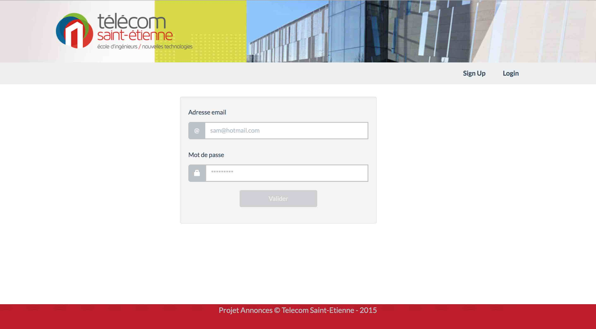
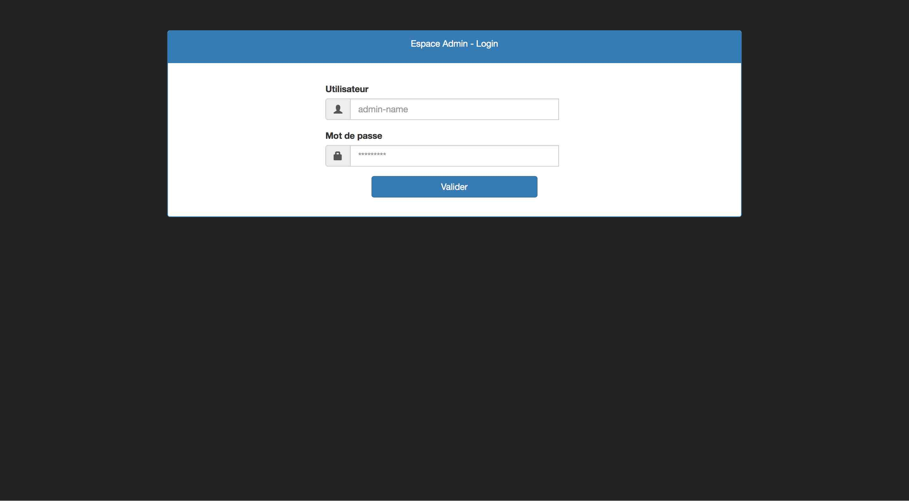
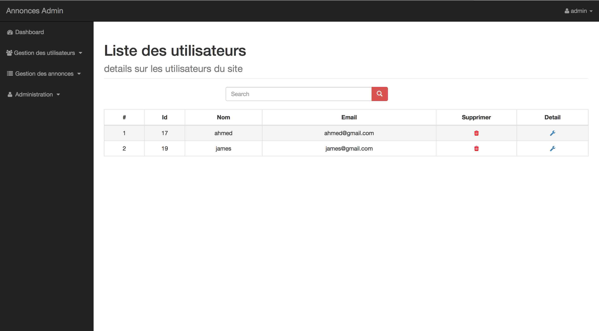

# Projet Architecture N-Tiers :  

###TSE Annonces -  Team #01

##### FI3 © 2014-2015 : 




Membres : 

* MARIN Olivier
* BOUHERROU Nacer
* AMENTAGUE Siham
* AHMED BACHA Abdelkrim

## Presentation
---
Dans ce projet, le but est de développer un site (style LeBonCoin) pour les étudiants de TSE afin qu'ils puissent avoir les annonces des logements disponibles (misent à disposition par l'école **nouvelle cité** ou par d'autres autres étudiants).

Repository GitHub (Branche #dev) :
https://github.com/ahmed-bacha/Projet-Annonces/tree/dev

## Structure du projet 
---

Structure du répertoire du projet avec un court descript
```
├── BDD
│   ├── annonce.sql         (copie de la structure de la BDD)
├── Admin
│   ├── JS                  (script propres à la section admin)
│   ├── CSS                 (styles propres à la section admin)
│   ├── *.php               (fchiers de traitements/vues de la séction admin)
├── Utils
│   ├── includeAll.php      (fichier de configuration/loader du projet)
│   ├── utilities.php       (fonctions utiles au projet)
├── Tests
├── Vues
│   ├── JS                  (script de la section )
│   ├── CSS                 (styles de la section )
│   ├── images              (images des annones du site)
│   ├── *.php               (fchiers de traitements/vues de la séction )
├── Modeles                 (modeles/structure/persistance des objets métiers)
├── Controlleurs            (controlleurs d'accès/manipulation des objets métier)
├── readMe.md               (descriptif du projet)
├── index.php               (redirection vers /Vues/log-in.php)
```

## Accès
---
* Le portail est accessible seulement aux utilisateurs inscrits.



* Les identifiants par defaut de la section **Admin**  (/Admin)
    * user : admin
    * mdp : admin



## Informations
---

*  Presque toutes les vues du site (utilisateur/admin) ont de l'Ajax par dessus, donc suivent une logique
    * un fichier pour la vue. 
    * un fichier js pour l'Ajax.
    * un fichier php pour le traitement.

*  Pour l'envoi des mails, on utilise l'API de MailGun (et non pas de fonction mail() de php) . 

## Deploiement ! 
---

***Prerequis***

Avoir un serveur Web (ex: Apache) avec php et MySQL+PhpMyAdmin installés.

***Etape 01 : Base de données***

Créer une base de données nommée : ***annonce***

Charger la base de données fournie, qui se trouve sous ***/BDD/annonce.sql*** , dans PhpMyAdmin avec un import.

***Etape 02 : variables utiles***

Mettre à jour les variables globales (user/password MySQL ...) dans le fichier ***/Utils/includeAll.php***

``` php
        define('DB_URL',        "localhost");
        define('DB_USER',       "root");
        define('DB_PASS',       "root");
        define('DB_NAME',       "annonce");
```

Remarque : 

en modifiant la variable ***SERVEUR*** dans /Utils/context.php, on peut configurer deux profils (LOCAL,SERVER)

***Etape 03 : MailGun API***

Activer le support pour l'envoie des emails via l'API MailGun, en cas de volonté de changement (envoie via Mail de PHP), modifier la fonction ***sendEmail()*** dans /Utils/utilities.php)


```shell
curl -sS https://getcomposer.org/installer | php
```

puis : 


```shell
php composer.phar require mailgun/mailgun-php:~1.7.2
```

***Etape 04 : Urls***


* URL publique : http://< ***your localhost*** > / < ***Project Dir. Name*** > /

exemple

```shell
http://localhost/Projet-Annonces/
```

* URL admin : http://< ***your localhost*** > / < ***Project Dir. Name*** > / Admin

exemple

```shell
http://localhost/Projet-Annonces/Admin
```


